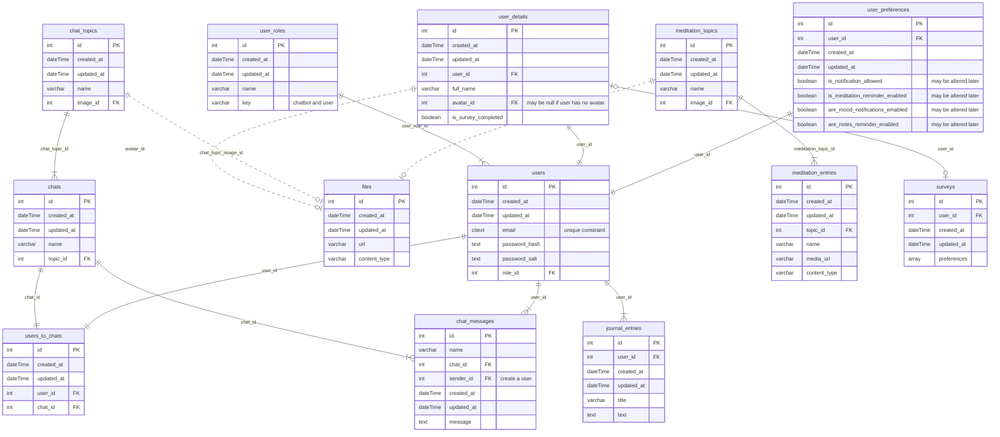

# CalmPal

AI-powered mental health app.

## 1. Introduction

### 1.1 Useful Links

- Pay attention, that we have certain [quality criteria](https://github.com/BinaryStudioAcademy/quality-criteria/blob/production/src/javascript.md), which we should follow during application development.

TODO: Add development deployment link

## 2. Domain

The product is an AI-based mental health app with the main feature being a highly engaged and supportive chatbot, along with additional features like a meditation function, journal, and mood tracker.

## 3. Requirements

- [NodeJS](https://nodejs.org/en) (18.x.x);
- [npm](https://www.npmjs.com/) (9.x.x);
- [PostgreSQL](https://www.postgresql.org/) (15.4)
- EsLint plugin is not supported - we use additional rules to check the code quality, some of which are not supported by the plugin

## 4. Database Schema



## 5. Architecture

### Application schema:

<picture>
  <source media="(prefers-color-scheme: dark)" srcset="./docs/application-architecture/calmpal-dark-theme.drawio.svg">
  <source media="(prefers-color-scheme: light)" srcset="./docs/application-architecture/calmpal-light-theme.drawio.svg">
  
</picture>

### 5.1 Global

#### 5.1.1 Technologies

1. [Typescript](https://www.typescriptlang.org/)
2. [npm workspaces](https://docs.npmjs.com/cli/v9/using-npm/workspaces)

### 5.2 Frontend

#### 5.2.1 Technologies

1. [React](https://react.dev/) — a frontend library
2. [Redux](https://redux.js.org/) + [Redux Toolkit](https://redux-toolkit.js.org/) — a state manager

#### 5.2.2 Folder Structure

1. assets - static assets (images, global styles)
2. libs - shared libraries and utilities

   2.1 components - plain react components

   2.2 enums

   2.3 helpers

   2.4 hooks

   2.5 packages - separate features or functionalities

   2.6 types

3. packages - separate app features or functionalities
4. pages - app pages
5. slices - redux slices

### 5.3 Backend

#### 5.3.1 Technologies

1. [Fastify](https://fastify.dev/) — a backend framework
2. [Knex](https://knexjs.org/) — a query builder
3. [Objection](https://vincit.github.io/objection.js/) — an ORM

#### 5.3.2 Folder Structure

1. db - database data (migrations, seeds)
2. libs - shared libraries and utilities

   2.1 enums

   2.2 exceptions

   2.3 helpers

   2.4 packages - separate features or functionalities

   2.5 types

3. packages - separate app features or functionalities

### 5.4 Mobile

This project is mainly focused on Android platform.

#### 5.4.1 Technologies

1. [React Native](https://reactnative.dev/) — a mobile library
2. [Redux](https://redux.js.org/) + [Redux Toolkit](https://redux-toolkit.js.org/) — a state manager

#### 5.4.2 Folder Structure

1. assets - static assets (images)
2. libs - shared libraries and utilities

   2.1 components - plain react components

   2.2 enums

   2.3 helpers

   2.4 hooks

   2.5 packages - separate features or functionalities

   2.6 types

3. navigations - app navigators
4. packages - separate app features or functionalities
5. screens - app screens
6. slices - redux slices

### 5.5 Shared Package

#### 5.5.1 Reason

As we are already using js on both frontend and backend it would be useful to share some contracts and code between them.

#### 5.5.2 Technologies

1. [Joi](https://github.com/sideway/joi) — a schema validator

## 6. How to Run

### 6.1 Manually

1. Create and fill all .env files. These files are:

- frontend/.env
- backend/.env
- mobile/.env

You should use .env.example folder as a reference.

1. Install dependencies: `npm install`.

2. Install pre-commit hooks: `npx simple-git-hooks`. This hook is used to verify code style on commit.

3. Run database. You can either run it in docker using command `docker-compose --env-file ./backend/.env -f docker-compose.services.yml up --build` or by installing postgres on your computer. Docker variant is preferred.

4. Apply migrations: `npm run migrate:dev -w backend`

5. Run backend: `npm run start:dev -w backend`

6. Run frontend: `npm run start:dev -w frontend`

7. Run mobile: `npm run start:dev -w mobile`

## 7. Development Flow

### 7.1 Pull Request Flow

```
<project-prefix>-<issue-number>: <ticket-title>
```

Examples:

- `cp-5: Add User Dashboard`

### 7.2 Branch Flow

```
<type>/<project-prefix>-<issue-number>-<short-desc>
```

Types:

- task
- fix

Examples:

- `task/cp-5-add-user-dashboard`
- `task/cp-12-add-user-flow`
- `fix/cp-16-fix-user-flow`

### 7.3 Commit Flow

```
<project-prefix>-<issue-number>: <modifier> <description>
```

Modifiers:

- `+` (add)
- `*` (edit)
- `-` (remove)

Examples:

- `cp-5: + title for dashboard`
- `cp-12: * dashboard title`
- `cp-16: - dashboard title`

## 8. Deployment

CI/CD implemented using [GitHub Actions](https://docs.github.com/en/actions)
